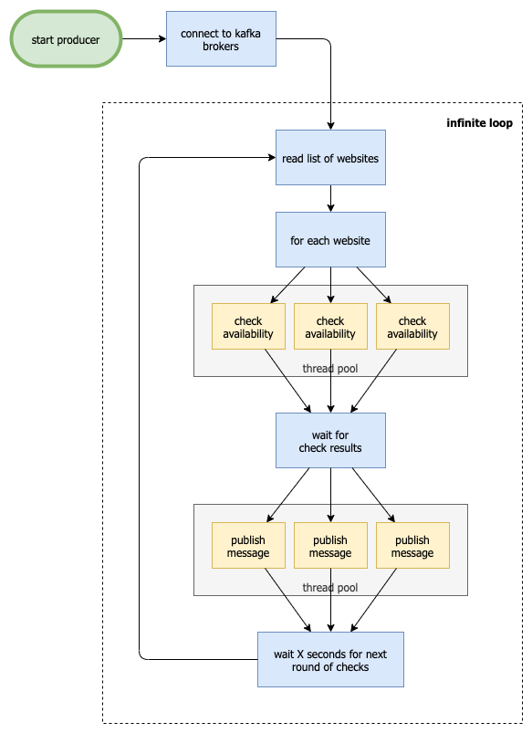
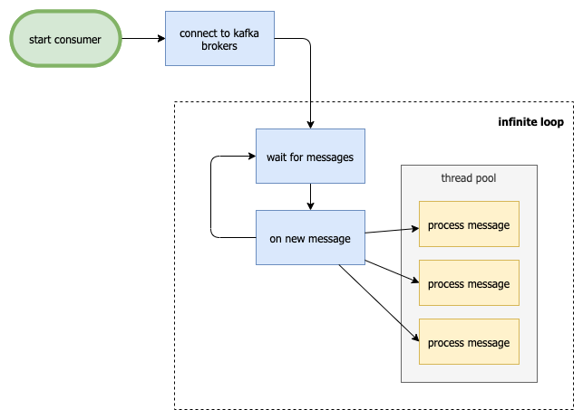

# Webmon - website monitor tool

## Problem Statement

In the following link you can find all details about the requirements related to this application. [Click here for more!](docs/problem_statement.txt)

## Build and run

### Dependencies

To build and run the application, you will need :

* Python 3.7+ (and pip3)
* Docker
* Docker compose (included with docker desktop versions)
* Python module pytest

The tests are run using `pytest` - the build script will install it using pip if it's not present.

### Build

To build the docker image with the application, please run the following command.
It will execute the tests and build the docker image locally.

```bash
./build.sh
```

If you just want to build the docker image without running the tests, you can use either one of the following commands.

```shell
docker-compose build
docker build . rfuchs/webmon:1.0
```

If you want to run only the tests, you can run this:

```shell
./test.sh
```

Note that the integration tests are commented out as it requires valid database/kafka connection information to run.
If you want to run/enabled them, configure the `config.yaml` file and then uncomment them.

### Running the application

To run the application, just execute the following command.

_You will need to add the information into the configuration file before running the application. `config.yaml` does not come with database and kafka values in this repository._

It will call `docker-composer up`, which will spin up two containers, one for the producer and one for the consumer.

```bash
make run
```

You can also skip the `make` command and run docker compose/docker run directly:

```bash
docker-compose up
```

```shell
docker run --rm -d --name webmon-consumer rfuchs/webmon:1.0 python3 consumer.py
docker run --rm -d --name webmon-producer rfuchs/webmon:1.0 python3 producer.py
```

```shell
docker run --rm -ti --name webmon-consumer rfuchs/webmon:1.0 python3 consumer.py
docker run --rm -ti --name webmon-producer rfuchs/webmon:1.0 python3 producer.py
```

### Running the services without docker image

When working on the application code, we may need to run the services in a more dynamic way, in our order to speed up  the local testing.
The following commands will help you run both services together and separate.

```shell
# run both services, consumer and producer
cd app/
python3 run.py

# run consumer service only
cd app/
python3 consumer.py

# run producer service only
cd app/
python3 producer.py
```

## Configuration

There is one configuration file that comes with the application, with some suggested values. You can change that before building the image.

If you want to run the application with an external configuration file, in order to be able to change configuration without rebuilding the image, you can map a volume and set the environment variable `WEBMON_CONFIG_FILE` with the path to the new file.

### Running with custom configuration file

```yaml
version: '3'

services:
  producer:
    container_name: rfuchs-producer
    build: .
    command: "python3 producer.py"
    environment:
      - WEBMON_LOG_LEVEL=INFO
      - WEBMON_CONFIG_FILE=/my/path/to/config.yaml    
```

### Database

The application works with a PostgreSQL database. The connection information can be configured in the `config.yaml` file as shown below.
The application will read the database password from a secure secrets manager/storage in the next release :)

```yaml
database:
    host: mydb.url.com
    port: 12345
    db: defaultdb-webmon-pool
    user: my_db_user
    password: xxxxxx
```

#### Tables

There are two tables being used by the application:

* `website (website_id, name, url, regex, status, timestamp)`
* `check_entry (check_entry_id, website_id, response_time, http_status, regex, regex_match, timestamp)`

#### Initial data

The database structure will be created when the services are started.
It will also add a few sample websites if they are not there yet.
You can find the SQL files in the `app/sql` folder.

### Kafka

The Kafka related configuration is as follows.

```yaml
kafka:
    server: my_kafka.url.com
    port: 12345
    topic: webmon
    consumer:
        group: webmon
```

### SSL files

If you need to connect to Kafka using SSL, you will need the SSL related files (ca, cert and key files). You can set them in the configuration file as shown below:

```yaml

kafka:
    ssl:
        cafile: ./certs/ca.pem
        certfile: ./certs/my_kafka.cert
        keyfile: ./certs/my_kafka.key
```

These files can be built into the docker image or mapped to an external folder thru a volume in the container.

### Log level

Per default, the log level is set to `DEBUG`.
You can change it in the `config.yaml` file or set the environment variable `WEBMON_LOG_LEVEL`, like mentioned in the example above.

### Monitoring interval

As described in the problem statement, the producer will check the websites availability every X seconds, which can be configured in the following configuration part. After the value is changed, the producer container has to be restarted.

```yaml
monitoring:
    interval: 30
```

### Multi threading

Both consumer and producer are multi threaded. You can configure the number of threads for each service in the `config.yaml` file.

```yaml
consumer:
    threads: 5
producer:
    threads: 5
```

## References

Here are some links related to

* <https://github.com/getsentry/responses#basics>
* <https://rob.conery.io/2014/05/29/a-better-id-generator-for-postgresql/>
* <https://www.postgresqltutorial.com/postgresql-uuid/>
* <https://realpython.com/python-logging/>
* <https://docs.python.org/3/library/logging.html>
* <https://docs.python.org/3/library/concurrent.futures.html>
* <https://kafka-python.readthedocs.io/en/master/usage.html>

## Contributions & Issues

Feel free to open issues and/or pull requests with additional features or improvements!
Collaboration is always welcome!!!

## How it works

High level overview of the producer and consumer flows.

### Producer



### Consumer


